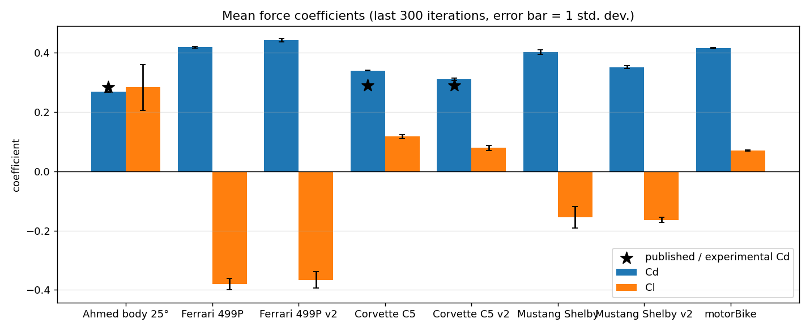

# Automotive External Aerodynamics with OpenFOAM

Steady RANS simulations of a validation body and several road and race cars, run in OpenFOAM v2606. Every case includes its complete setup, so you can
reproduce it with a single `./Allrun`. The results include force coefficients,
convergence histories and mesh-quality logs.




### Highlight: [Corvette C5 v2](corvette-v2/)

The first Corvette run was 17 % above GM's published Cd of 0.29. Changing one thing at a time
measured each cause separately: domain blockage (−9 counts), near-wall and wake refinement (no change in drag,
−24 % lift) and rotating wheels (−20 counts, half of it on the body). That brought the gap to **+7 %**.


### Highlight: [Mustang Shelby v2](mustang-v2/)

The Mustang showed front *downforce*, which is unusual for a road car, and it survived every setup fix. Surface-pressure
analysis traces it to the tall nose: suction under the air dam and stagnation on the splitter (real design effects),
plus stagnation on the model's closed grille and intake (an artifact, since the visual model has no cooling flow).


## Results

| Case | Cells | Cd | Cl | Notes |
|---|---:|---:|---:|---|
| [Ahmed body, 25° slant](ahmed-body/) | 8.4 M | **0.268** ± 0.001 | +0.283 ± 0.078 | Validation case. Experiment: Cd ≈ 0.285 (−6 %) |
| [Ferrari 499P (LMH)](ferrari-499p/) | 4.7 M | 0.419 ± 0.002 | **−0.381** ± 0.019 | First run; car sunk into the ground. Superseded by v2 |
| [Chevrolet Corvette C5](corvette/) | 3.7 M | 0.340 ± 0.002 | +0.118 ± 0.006 | First run; superseded by v2 |
| [Chevrolet Corvette C5 v2](corvette-v2/) | 10.5 M | **0.311** ± 0.003 | +0.080 ± 0.009 | Larger domain, 3 layers, rotating wheels. Published Cd 0.29 (+7 %) |
| [Ferrari 499P v2](ferrari-499p-v2/) | 12.0 M | 0.443 ± 0.005 | **−0.366** ± 0.028 | On its tyres (was sunk 66 mm) + v2 setup. Front axle lifts: dead-end nose duct in the model |
| [Ford Mustang Shelby (2012)](mustang/) | 3.9 M | 0.403 ± 0.008 | −0.155 ± 0.036 | First run; superseded by v2 |
| [Ford Mustang Shelby v2](mustang-v2/) | 10.3 M | **0.352** ± 0.004 | −0.164 ± 0.008 | Corvette v2 setup. Front downforce traced to the nose and closed grille |
| [motorBike (OpenFOAM tutorial)](motorbike/) | 0.35 M | 0.416 ± 0.001 | +0.071 ± 0.002 | Baseline used to learn the workflow |

Coefficients are the mean ± one standard deviation over the last 300 iterations,
referenced to each vehicle's frontal area. The frontal areas were measured from the
geometry with [`tools/frontal_area.py`](tools/frontal_area.py).

## Method (common to all cases; v2 differences in brackets)

| | |
|---|---|
| Solver | `simpleFoam`: steady, incompressible, SIMPLE algorithm |
| Domain | 35 × 10 × 6 m with slip side and top walls, about 3 % blockage for the cars (v2: 60 × 20 × 10 m, 1 %) |
| Turbulence | k-ω SST, wall functions (mean y+ ≈ 60–90 where measured) |
| Freestream | 40 m/s (20 m/s for motorBike), ν = 1.5×10⁻⁵ m²/s |
| Ground | Moving wall at freestream speed (no ground boundary layer) |
| Wheels | Stationary (v2: rotating, `rotatingWallVelocity`) |
| Mesh | `blockMesh` background + `snappyHexMesh` (castellated, snapped, 1 prism layer; v2: 3 layers and a 16 mm box around the car and near wake) |
| Discretisation | Bounded `linearUpwindV` for momentum, GAMG for pressure |
| Initialisation | `potentialFoam` |
| Run | 1500 iterations (500 for motorBike), decomposed across 6 cores (v2: 8) |
| Convergence | Residuals level off around 10⁻² (10⁻³ for some velocity components) (normal for steady RANS on bluff bodies), so convergence is judged by Cd and Cl settling to a steady mean |

## Lessons learned

- **Check that the reference values match the geometry.** The 499P was first run with the
  Mustang's reference area. Its `controlDict`, copied from the Mustang case, had the force settings
  written directly into it, so the 499P values in `system/forceCoeffs` were never read. That made its Cd and Cl
  28 % too small. Coefficients scale exactly with 1/Aref, so I corrected them in post-processing. The
  pitching moments can't be corrected this way, because the moment reference point also
  differed. The case in the repo is fixed. Checking the header of `coefficient.dat` after every run
  would have caught this immediately.
- **Measure reference areas; don't estimate them.** `frontal_area.py` projects the STL onto
  the y–z plane. For the Corvette it gave 1.989 m² against a 1.95 m² estimate, which resulted in a 2 % change in Cd.
- **Steady RANS on bluff bodies doesn't settle completely.** Lift on the Ahmed body
  and Mustang oscillates by ±25 % while drag stays within ±2 %. Averaging over a window is
  necessary, and an unsteady (URANS/DES) run would be the next step.
- **A few bad cells can distort the post-processing.** On every car, a handful of cells next to the
  highly skewed faces show nonphysical pressures (as low as −46,000 m²/s² on the 499P, where
  the physical range is about −2,000 to +800). That's 3 cells out of 4.7 M, too few to
  change the integrated forces, but enough to stretch ParaView's automatic colour scale. The Ahmed
  body, with no skewed faces, doesn't have this problem, which points to mesh quality as the cause.
- **Size the domain for blockage.** The original domain blocked 3.3 % of the flow around the Corvette. With slip
  walls, that acts like a small wind tunnel and adds drag. Enlarging it to 1 % blockage removed 9 counts of drag.
- **Drag and lift converge differently.** Tripling the Corvette's mesh left Cd unchanged (−0.03 %) but moved Cl by −24 %.
  Check mesh sensitivity for each quantity you report.
- **Wheels matter beyond their own area.** Rotating the Corvette's wheels cut Cd by 6 %, half of it on the body,
  because a stationary tyre's wake disturbs the wheel wells, sides and underbody.
- **Check where the car sits before meshing.** The 499P's tyres were 66 mm into the ground and its floor 9–20 mm off it,
  too thin a gap to mesh. Putting it on its tyres changed floor downforce by 30 %.
- **Visual models can have dead-end ducts.** The 499P's nose duct has no exit, so it fills with stagnant air. That adds
  Cd +0.10, and the front underbody can't make downforce. Count *every* wall of a cavity: its ceiling alone looked like
  +0.4 of lift, but the floor below it cancels that.
- **Visual models have no cooling flow.** Their grilles and intakes are solid, so air stagnates against them.
  On the Mustang's large upright grille, that added about −0.085 of front downforce that the real car wouldn't have.
  Surface-pressure breakdowns show which surfaces a force comes from before you trust it.
- **Downloaded visual models need repair before meshing.** The Sketchfab cars had to be
  cleaned, welded and closed into watertight surfaces before `snappyHexMesh` would
  produce a usable mesh.

## Repository layout

```
<case>/
  README.md        setup, mesh, results, discussion
  case/            system/, constant/, 0.orig/, Allrun, Allclean  → run with ./Allrun
  results/
    forceCoeffs1/  coefficient history (coefficient.dat)
    solverInfo1/   residual history
    yPlus/         y+ statistics (where computed)
    logs/          blockMesh, snappyHexMesh, checkMesh logs; solver log (.gz)
    convergence.png
    run1/, run2/ ... multi-run studies keep each run's results separately (see corvette-v2)
tools/
  frontal_area.py  frontal area from an STL
  split_wheels.py  labels wheels as separate STL regions so they can rotate (with exclusion boxes for suspension)
  plot_results.py  regenerates every plot and the summary table numbers
```

## Reproducing

```bash
source /usr/lib/openfoam/openfoam2606/etc/bashrc   # or your OpenFOAM install
cd ahmed-body/case
./Allrun                    # mesh, decompose, solve on 6 cores, reconstruct
cd ../.. && python3 tools/plot_results.py
```

The geometry is stored gzipped (`*.stl.gz`); OpenFOAM reads it directly. The full
cases are 10–20 GB each once run, so meshes and field data are not tracked.

## Geometry credits

The car models come from Sketchfab under
[CC BY 4.0](https://creativecommons.org/licenses/by/4.0/). They were modified for CFD:
repaired, made watertight, rotated and scaled.

- Ferrari 499P: ["2024 Ferrari 499P"](https://sketchfab.com/3d-models/2024-ferrari-499p-bed18b70ae904a3792a316d9327d5942) by Dave Love SketchFab
- Chevrolet Corvette C5: ["Chevrolet corvette c5 (Black)"](https://sketchfab.com/3d-models/chevrolet-corvette-c5-black-604ffcf3bb544ae9b653e8cfc1fae87a) by Randomness
- Ford Mustang Shelby: ["Ford Mustang Shelby 2012"](https://sketchfab.com/3d-models/ford-mustang-shelby-2012-b60b3a520c024fd69416d56a71900626) by David_Holiday

The Ahmed body follows the geometry of Ahmed, Ramm & Faltin (1984), SAE 840300.
The motorBike geometry ships with the OpenFOAM tutorials.
