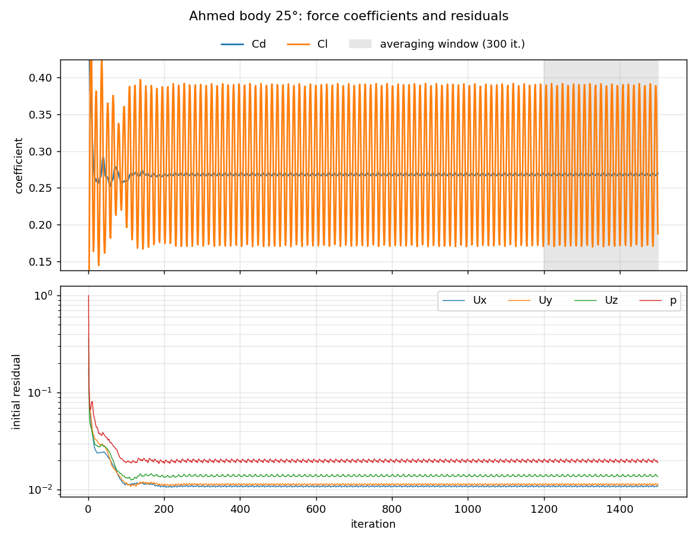

# Ahmed Body, 25° Slant: Validation Case

The Ahmed body is a simplified car shape with a slanted rear, and it's the standard
benchmark for automotive CFD. At a 25° slant the flow partly separates over the rear and
forms strong vortices at the C-pillars, which RANS models find hard to predict. That makes
it a good test of the method before applying it to real cars.

## Setup

| | |
|---|---|
| Body | Length 1.044 m, frontal area 0.112 m² (0.389 × 0.288 m) |
| Freestream | 40 m/s, Re ≈ 2.8×10⁶ (based on length) |
| Turbulence | k-ω SST with wall functions |
| Mesh | 8.38 M cells (99 % hexahedra), 1 prism layer |
| Mesh quality | All `checkMesh` tests passed: max skewness 3.0, max aspect ratio 26 |
| y+ on body | mean 64, range 3–240 |
| Run time | 1500 iterations, 2.9 h on 6 cores |

## Results

| | CFD | Experiment (Ahmed et al. 1984) | Difference |
|---|---:|---:|---:|
| Cd | 0.268 ± 0.001 | ≈ 0.285 | −6 % |
| Cl | +0.283 ± 0.078 | — | — |

The rear of the body produces nearly all of the lift (front Cl ≈ 0.01, rear Cl ≈ 0.27).
This is the suction over the slant and the vortices at the C-pillars.

## Discussion

- **Drag within 6 % of the experiment** is a reasonable result for steady RANS
  at a 25° slant. That angle sits just below the critical ~30°, where the flow over the slant
  switches from partly attached to fully separated, so it's a sensitive regime.
- **The lift oscillates by about ±28 %** while drag holds within 1 %. The separation bubble
  on the slant doesn't reach a steady state, which suggests the flow is unsteady in
  reality. A time-accurate simulation (URANS or DES) would capture this better.
- **Possible causes of the drag difference:** a single prism layer and wall functions
  (mean y+ ≈ 64) affect how accurately separation on the slant is predicted. Also, k-ω SST
  tends to predict separation that's too large or too small in this regime.
- **Next steps:** a mesh-independence study (coarse, medium and fine meshes), more prism
  layers at y+ ≈ 1 with low-Re wall treatment, and comparison with the velocity profiles
  measured by Lienhart & Becker (2003).

## Files

- [`case/`](case/): the complete OpenFOAM case; run with `./Allrun`
- [`results/forceCoeffs1/`](results/forceCoeffs1/): Cd and Cl history
- [`results/yPlus/`](results/yPlus/): y+ statistics
- [`results/logs/`](results/logs/): meshing, `checkMesh` and solver logs
