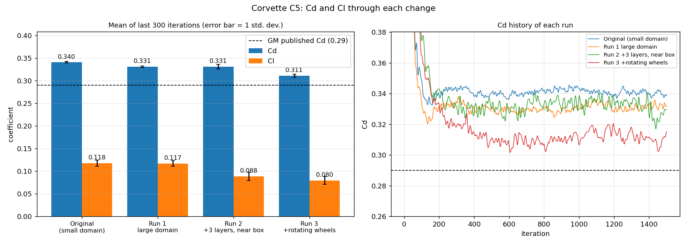
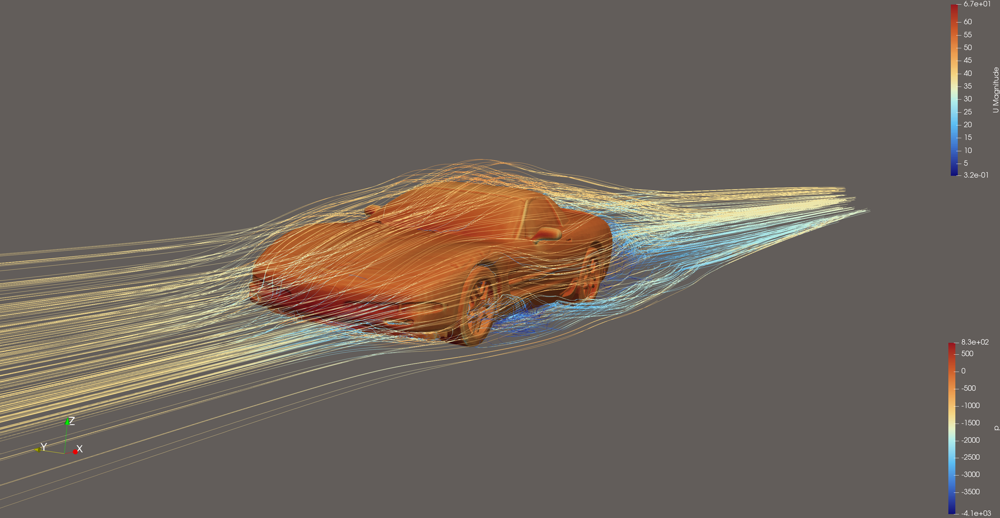
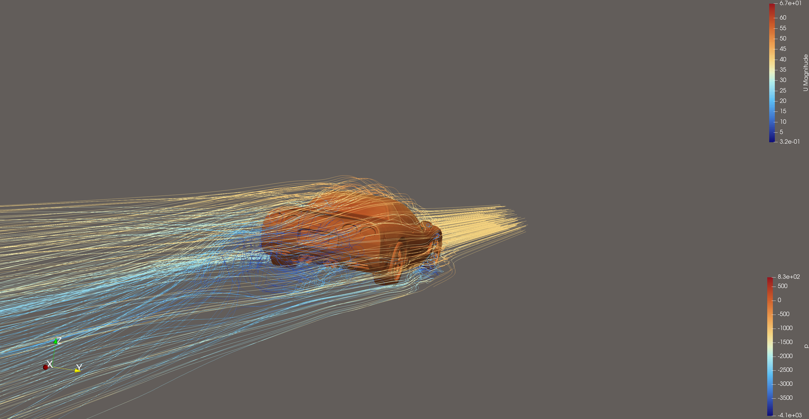
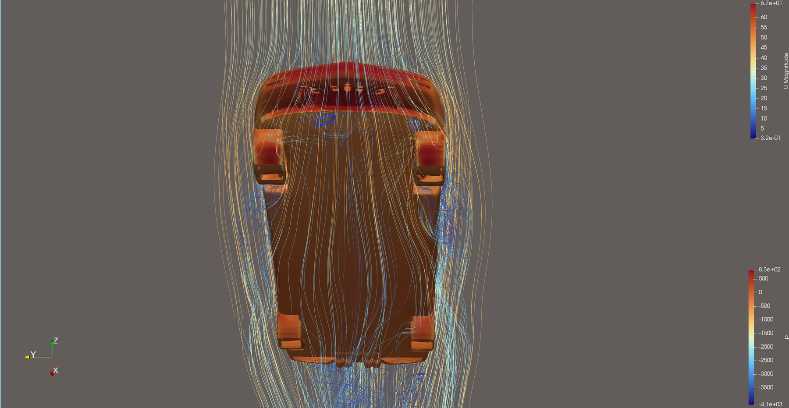

# Chevrolet Corvette C5, v2: Closing the Gap to the Published Cd

The [first Corvette run](../corvette/) gave Cd = 0.340, 17 % above GM's published 0.29.
This study changes the setup one step at a time, so that each change's effect on drag
is measured on its own rather than guessed.

| Run | What changed | Cells | Cd | Cl | Cl front / rear |
|---|---|---:|---:|---:|---:|
| [Original](../corvette/) | 10 × 6 m slip-walled domain | 3.7 M | 0.340 ± 0.002 | 0.118 | 0.085 / 0.033 |
| Run 1 | Larger domain (blockage 3.3 % → 1.0 %) | 3.8 M | 0.331 ± 0.002 | 0.117 | 0.081 / 0.036 |
| Run 2 | + 3 prism layers, 16 mm cells around the car and near wake | 10.5 M | 0.331 ± 0.005 | 0.089 | 0.070 / 0.019 |
| **Run 3** | **+ rotating wheels** | **10.5 M** | **0.311 ± 0.003** | **0.080** | 0.055 / 0.024 |
| GM (wind tunnel, real car) | | | 0.29 | | |

Mean ± one standard deviation over the last 300 of 1500 iterations. All runs use the
measured frontal area of 1.989 m² (the original run is rescaled from its estimated 1.95 m²).

**Result:** the gap to the published value went from +17 % to **+7 %**. That's within
the 5–10 % typically expected from steady RANS on a production car, and every step has
a measured cause.

| | |
|---|---|
| Blockage | **−9 counts** of drag (one count = 0.001 Cd) |
| Near-wall and near-wake mesh refinement | **~0 counts** of drag, but −24 % lift |
| Rotating wheels | **−20 counts**, about half of it on the body rather than the wheels |

|  |
|:--:|
| Run 3, front three-quarter view |

|  |
|:--:|
| Run 3, rear three-quarter view |

|  |
|:--:|
| Run 3, underside viewed from below (flow runs top to bottom) |

*Body coloured by kinematic pressure p (m²/s²); streamlines coloured by velocity magnitude (m/s).
The pressure scale runs down to −4100 because of a few bad cells next to highly skewed faces
(see [the original case](../corvette/#nonphysical-pressure-in-a-few-cells)). The physical range is
about −2000 to +800.*

## Where the drag was coming from

Before changing anything, I integrated the surface pressure of the original run along the car:

| Region | Cd |
|---|---:|
| Nose, first 0.4 m (bumper stagnation) | +0.174 |
| Hood, windshield, roof (suction pulls the car forward) | −0.055 |
| Rear wheels and arches | +0.063 |
| Tail and base | +0.120 |
| Rear quarter panels (x = 3.6–4.2 m) | +0.017 |
| Skin friction | +0.020 |
| **Total (iteration 1500)** | **0.339** |

94 % of the drag was pressure drag, so the fix had to change the flow field (blockage,
separation, wake, wheels), not wall friction.

## Run 1: domain blockage

The original domain was 10 m wide and 6 m tall, with slip walls on the sides and top: in effect
a small wind tunnel. The car blocked 3.3 % of its cross-section, against a guideline of
under 1–1.5 % for automotive CFD. The inlet was also only 2.2 car lengths ahead and the outlet 4.5 lengths behind.

| | Original | Run 1 |
|---|---|---|
| Domain (x, y, z) | −10..25, ±5, 0..6 m | −15..45, ±10, 0..10 m |
| Inlet / outlet distance | 2.2 / 4.5 car lengths | 3.3 / 8.8 car lengths |
| Blockage | 3.3 % | 1.0 % |
| Background cell | 0.5 m | 0.5 m (unchanged, so the near-car mesh is identical) |

**Cd 0.340 → 0.331 (−9 counts).** Lift barely moved, which makes sense: blockage mainly
speeds up the flow around the sides and top of the car.

## Run 2: near-wall and near-wake resolution

- **Prism layers: 1 → 3** (expansion ratio 1.2). The target thickness of the layer next to the wall was set about 30 % thinner.
  snappyHexMesh achieved an average of 2.2 layers, at 67 % of the target thickness, with 88.7 % coverage.
  The mean y+ on the body is 78, within the wall-function range.
- **A level-5 refinement box** (16 mm cells instead of 31 mm) from 0.5 m ahead of the car to 3 m
  behind it, to resolve the flow around the bumper, windshield header, A-pillars and the near wake.

**Cd 0.3310 → 0.3309 (−0.03 %), Cl 0.117 → 0.089 (−24 %).** Tripling the cell count left drag
unchanged, so at this resolution drag no longer depends on the near-wall and near-wake mesh.
Lift is clearly more sensitive, because it depends on small pressure differences between the
underbody and the upper surfaces. So the drag result is solid, and the lift carries more uncertainty.

*Caveat:* this is a two-mesh comparison, and the surface cell size (levels 5–6, 16–8 mm) was the
same in both. A formal mesh-independence study would refine everywhere across three meshes. At about 2 GB of
RAM per million cells, the 25 GB available limits this machine to roughly 12 M cells.

## Run 3: rotating wheels

With the ground moving at 40 m/s but the wheels stationary, the contact patches were scraping
along the road and the tops of the tyres were standing still in the airflow. Real wheels roll.

1. **Splitting the geometry.** The Sketchfab model is a single welded surface, so I wrote
   [`tools/split_wheels.py`](../tools/split_wheels.py). It labels every triangle inside each wheel's cylinder as its own STL
   region (`wheel_FL`, `wheel_FR`, `wheel_RL`, `wheel_RR`). The axle centres and radii were fitted
   from the tyre geometry and agree with the C5's published tyre sizes (245/45ZR17 front, 275/40ZR18 rear)
   to within about 7 mm. The tyre/arch cutoff sits in the gap between tyre and wheel arch. I checked that no arch
   surface was included.
2. **Boundary condition.** snappyHexMesh turns each region into its own patch, and each gets
   `rotatingWallVelocity` about the y axis with ω = −U / r, where r is the axle height above the ground (0.317 m
   front, 0.329 m rear). That makes the contact patch move at exactly the ground speed.
3. **Wheel forces.** The wheels are also collected into a `wheelGroup`, with a separate
   `forceCoeffs` output ([`system/wheelForces`](case/system/wheelForces)).

**Cd 0.331 → 0.311 (−20 counts, −6 %).** Pressure forces at iteration 1500, stationary vs. rotating:

| | Run 2 (stationary) | Run 3 (rotating) | Change |
|---|---:|---:|---:|
| Front-left wheel | 0.024 | 0.023 | −0.001 |
| Front-right wheel | 0.033 | 0.029 | −0.004 |
| Rear-left wheel | 0.015 | 0.013 | −0.002 |
| Rear-right wheel | 0.015 | 0.014 | −0.001 |
| **All wheels** | **0.087** | **0.080** | **−0.007** |
| **Body** | **0.222** | **0.215** | **−0.007** |

- **Wheels account for about 28 % of the car's pressure drag,** in line with published figures for road cars.
- **Half of the reduction is on the body, not the wheels.** A stationary tyre throws a larger, messier wake into
  the wheel wells, along the sides and under the car. Rolling wheels clean that up, and the body benefits.
  Modelling the wheels correctly changes the drag of the whole car, not just the wheels.
- **The front wheels produce about 60 % more drag than the rears.** They meet undisturbed air, while the rears sit in the body's wake.
- **The front right has more drag than the front left in both runs.** The model probably isn't perfectly
  mirror-symmetric (the tyre fit also came out slightly different on that side).
- **Limitation:** a rotating-wall condition moves the wheel surface, but the spokes don't sweep the
  air like a fan. A rotating mesh region (MRF) or sliding mesh would capture that.

## What's left of the gap (0.311 vs 0.29)

- **Steady RANS with k-ω SST:** it has limits with the unsteady wake behind the car.
- **The visual model:** its open, detailed underbody and wheel wells add drag. The upstream-facing surface area is
  about 3× the frontal area.
- **The wind-tunnel number:** it comes from the real car with cooling airflow, a specific ride height and the tunnel's own corrections.
- **Convergence:** Cd still drifts down by about 0.7 % between iterations 900–1200 and 1200–1500. A longer run would confirm the final value.

## Practical notes

- **Cost:** Run 1 took 1.2 h on 6 cores. Runs 2 and 3 took 3.3 h each on 8 cores, using about 21 GB of RAM (about 2 GB per million cells).
- **Cores:** going from 6 to 8 cores gave no measurable speedup per cell. OpenFOAM is limited by memory bandwidth on a desktop.
- **`Allclean`:** the template's `Allclean` deleted `constant/triSurface`, including the STL. I removed that line.
- **Mesh quality:** `checkMesh` still reports about 20 highly skewed faces (max skewness 10.5) in all three runs. They're unchanged by
  these edits and the source of the few nonphysical pressure cells.

## Files

- [`case/`](case/): the complete Run 3 case. Run it with `./Allrun` (8 cores). The geometry is `constant/triSurface/corvette.stl.gz`,
  already split into 5 regions, and [`wheels.json`](case/constant/triSurface/wheels.json) holds the wheel cylinders used to split it.
- [`results/run1/`](results/run1/), [`run2/`](results/run2/), [`run3/`](results/run3/): force and residual histories, logs, and
  `settings/` with each run's `blockMeshDict` and `snappyHexMeshDict` (plus `U` and `wheelForces` for Run 3).
  Run 3 also includes `wheelCoeffs/` (wheel-only forces) and `yPlus/`.
- [`results/run2/wheel_drag_baseline.txt`](results/run2/wheel_drag_baseline.txt),
  [`results/run3/wheel_drag_comparison.txt`](results/run3/wheel_drag_comparison.txt): the wheel/body breakdown above.
