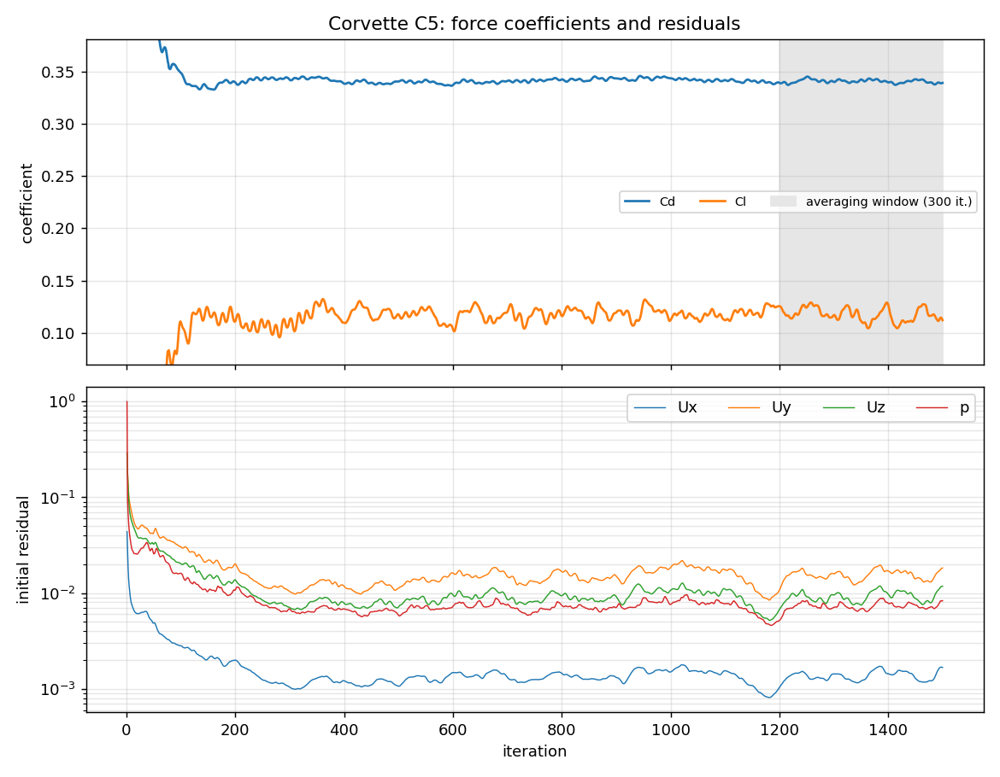

# Chevrolet Corvette

External aerodynamics of a production sports car.

## Setup

| | |
|---|---|
| Geometry | Sketchfab model (CC BY 4.0), converted from OBJ, cleaned, welded and closed |
| Reference values | Frontal area 1.989 m² (measured, see [`frontal_area.png`](results/frontal_area.png)), wheelbase 2.655 m |
| Freestream | 40 m/s |
| Turbulence | k-ω SST with wall functions |
| Mesh | 3.74 M cells (91 % hexahedra), 1 prism layer |
| Mesh quality | 19 faces above the skewness limit (max 10.5); all other checks passed |
| Run time | 1500 iterations, 1.1 h on 6 cores |

## Results

| | Value |
|---|---:|
| Cd | 0.340 ± 0.002 |
| Cl | +0.118 ± 0.006 |
| Cl front / rear | +0.085 / +0.033 |

The solver ran with an estimated frontal area of 1.95 m². The values above are rescaled to
the measured 1.989 m², a factor of 0.980. The raw `coefficient.dat` is unchanged.

## Discussion

- **This is the most stable solution in the set**: Cd varies by ±0.6 % and Cl by ±5 %
  over the last 300 iterations.
- **The car produces net lift, mostly at the front.** That's typical for a road car
  without active aero, and it would make the car less stable at high speed. A front splitter
  or underbody changes would be the first things to test.
- **Mesh quality:** the skewed faces are in small, detailed areas of the geometry.
  With only 19 skewed faces out of 11.6 million, they're unlikely to affect the integrated
  forces, but it would be worth checking where they are.

## Files

- [`case/`](case/): the complete OpenFOAM case (geometry in `constant/triSurface/corvette.stl.gz`)
- [`results/`](results/): coefficient and residual histories, logs
