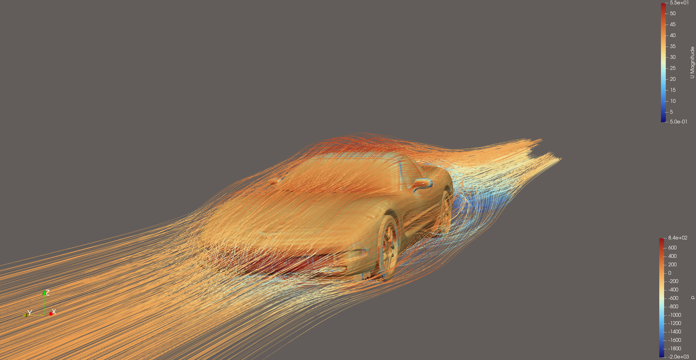
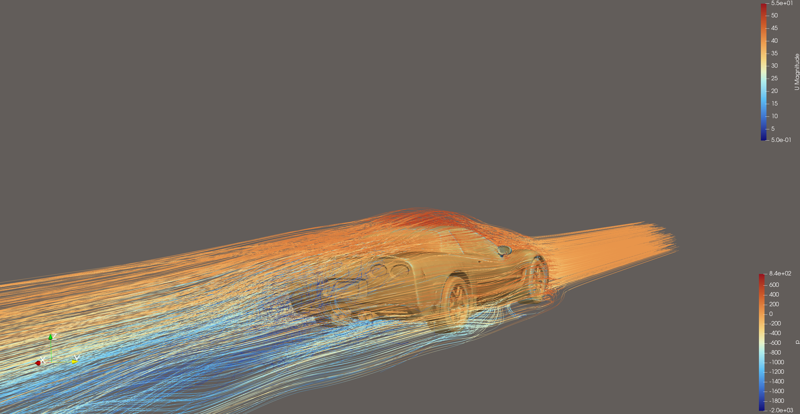
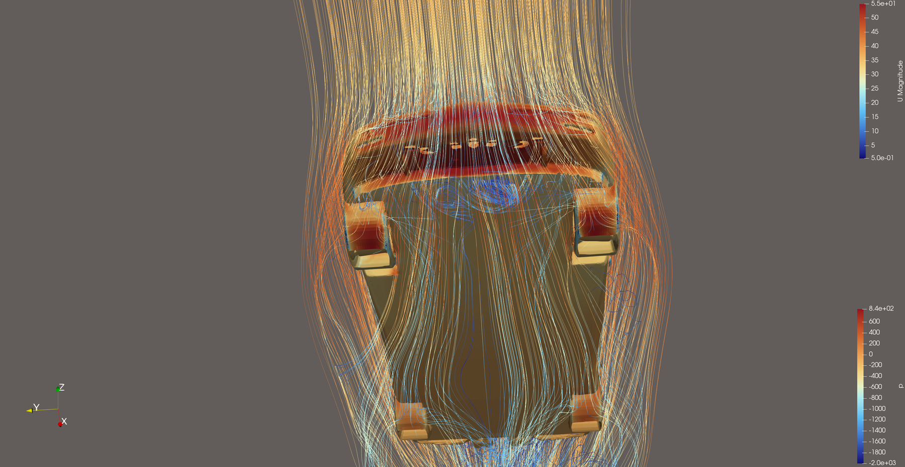

# Chevrolet Corvette C5

> **Superseded by [Corvette C5 v2](../corvette-v2/),** which traces this run's 17 % gap to the
> published Cd to domain blockage and stationary wheels, and brings it down to 7 %.

External aerodynamics of a production sports car (C5 generation, 1997–2004).

|  |
|:--:|
| Front three-quarter view |

|  |
|:--:|
| Rear three-quarter view |

|  |
|:--:|
| Underside, viewed from below (flow runs top to bottom) |

*Body surface coloured by kinematic pressure p (m²/s², fixed range −2000 to +840; +800 is the stagnation value ½U² at 40 m/s). Streamlines coloured by velocity magnitude (m/s).*

## Setup

| | |
|---|---|
| Geometry | ["Chevrolet corvette c5 (Black)"](https://sketchfab.com/3d-models/chevrolet-corvette-c5-black-604ffcf3bb544ae9b653e8cfc1fae87a) by Randomness (CC BY 4.0), converted from OBJ, cleaned, welded and closed |
| Reference values | Frontal area 1.989 m² (measured, see [`frontal_area.png`](results/frontal_area.png)), wheelbase 2.655 m |
| Freestream | 40 m/s |
| Turbulence | k-ω SST with wall functions |
| Mesh | 3.74 M cells (91 % hexahedra), 1 prism layer |
| Mesh quality | 19 faces above the skewness limit (max 10.5); all other checks passed |
| Run time | 1500 iterations, 1.1 h on 6 cores |

## Results

| | Value |
|---|---:|
| Cd | 0.340 ± 0.002 |
| Cl | +0.118 ± 0.006 |
| Cl front / rear | +0.085 / +0.033 |

The solver ran with an estimated frontal area of 1.95 m². The values above are rescaled to
the measured 1.989 m², a factor of 0.980. The raw `coefficient.dat` is unchanged.

## Nonphysical pressure in a few cells

OpenFOAM's `p` is kinematic (pressure divided by density, in m²/s²). At 40 m/s it should range from about +800 at the
stagnation point down to a few thousand negative. In the final solution, 69 cells fall below −3,000 and the
minimum is −13,325, while 99.99 % of cells lie between −1,507 and +800. These cells sit next to the highly skewed
faces reported by `checkMesh`. They're too few to affect the integrated forces, but they stretch the automatic colour
range in ParaView, which is why the images above use a fixed range of −2000 to +840.
The fix is to improve the local mesh quality there (surface repair, snapping controls or mesh-quality settings in
`snappyHexMeshDict`).

## Discussion

- **This is the most stable solution in the set**: Cd varies by ±0.6 % and Cl by ±5 %
  over the last 300 iterations.
- **The car produces net lift, mostly at the front.** That's typical for a road car
  without active aero, and it would make the car less stable at high speed. A front splitter
  or underbody changes would be the first things to test.
- **Mesh quality:** the skewed faces are in small, detailed areas of the geometry.
  With only 19 skewed faces out of 11.6 million, they're unlikely to affect the integrated
  forces, but it would be worth checking where they are.

## Files

- [`case/`](case/): the complete OpenFOAM case (geometry in `constant/triSurface/corvette.stl.gz`)
- [`results/`](results/): coefficient and residual histories, logs
