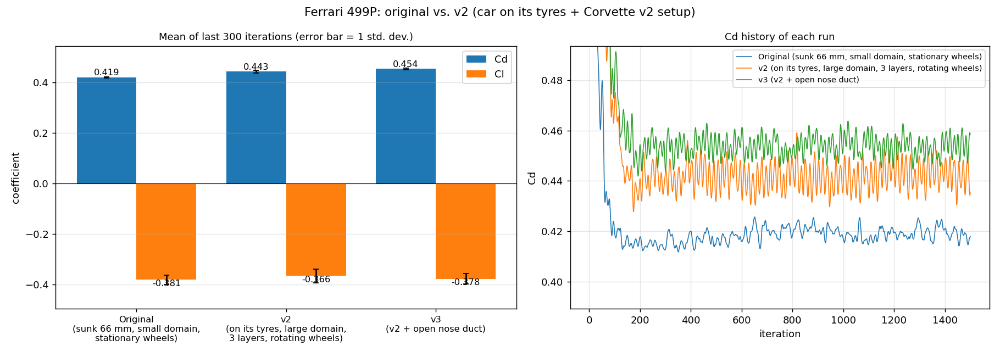
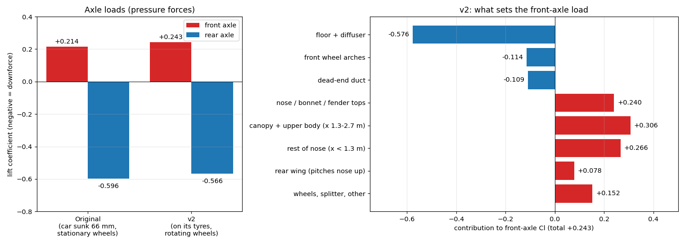
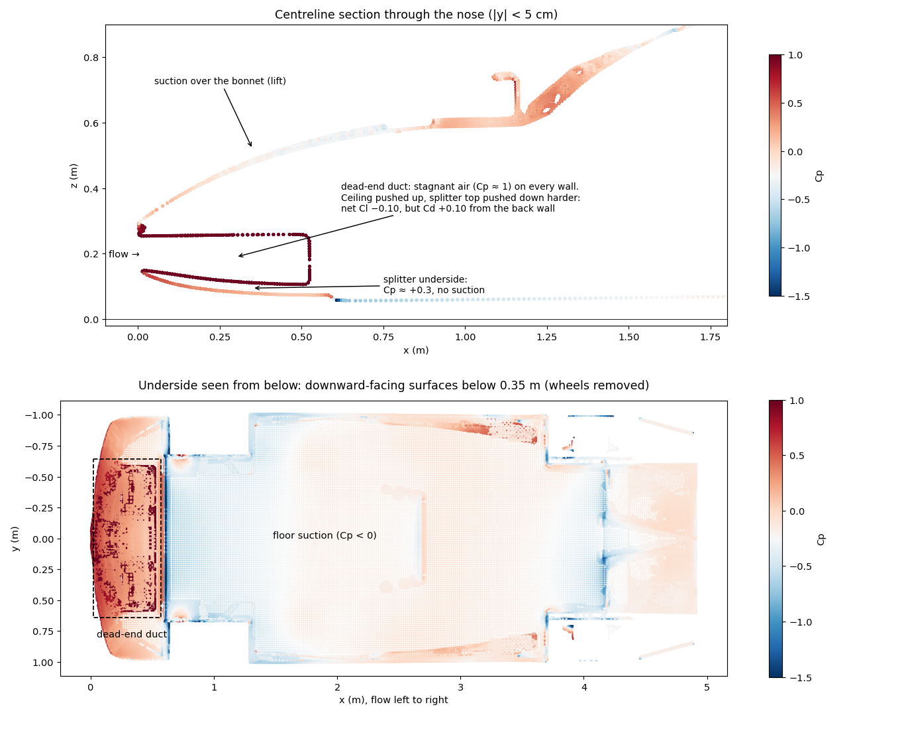

# Ferrari 499P, v2: Ride Height, and Why the Front Axle Lifts

The [original 499P run](../ferrari-499p/) had three problems of its own on top of the setup issues
fixed in the [Corvette v2 study](../corvette-v2/):

1. **The car was sunk into the ground.** The tyres went 53–66 mm below the ground plane, and the floor sat only
   **9–20 mm** above it, so snappyHexMesh could barely fit one cell under the car.
2. **The car wasn't inside the refinement box.** It was centred on x = 0, so the front 1.45 m was meshed with
   coarse cells.
3. **Its front/rear lift split was wrong.** The `controlDict` carried the Mustang's moment reference point and
   length (see the [original case](../ferrari-499p/#correction-applied-to-the-results)).

This case fixes all three, applies the validated setup, and then uses the surface pressure to find out where the
front-axle load comes from.

| | Cells | Cd | Cl | Cl front / rear |
|---|---:|---:|---:|---:|
| [Original](../ferrari-499p/) | 4.7 M | 0.419 ± 0.002 | −0.381 ± 0.019 | +0.214 / −0.596 (corrected, see below) |
| **v2** | **12.0 M** | **0.443 ± 0.005** | **−0.366 ± 0.028** | **+0.230 / −0.596** |
| v2, wheels only | | 0.047 | +0.055 | +0.043 / +0.012 |

Mean ± one standard deviation over the last 300 of 1500 iterations. Each run uses its own measured frontal area:
1.6437 m² for the original and 1.6762 m² for v2, which is slightly larger because the previously buried tyres
are now visible.

## Putting the car on its tyres

| | Original | v2 |
|---|---|---|
| Tyre depth below ground | 66 mm front, 53 mm rear | 13 mm front, 27 mm rear (a loaded contact patch) |
| Floor clearance (centreline) | 9–20 mm | 57 mm at the front → 94 mm at the rear |
| Nose position | x = −2.45 m (front 1.45 m outside the refinement box) | x = 0, like the other cars |

The geometry was moved with `surfaceTransformPoints -translate '(2.447 0 0.048)'`. That's 48 mm up, the least that
puts both axles on the ground without lifting either tyre off it. The model's own rake is unchanged.
**The real 499P's ride height isn't known here,** so "resting on its own tyres" is the most defensible choice rather
than a claim about the real car.

**Effect:** floor and diffuser downforce fell from Cl −1.45 to −1.00, as ground effect predicts (a floor makes
more suction the closer it runs to the ground). In the original, the floor was so close that the gap was barely resolved.
Drag rose from 0.419 to 0.443, mostly because the exposed, rotating tyres now carry realistic drag
(wheel Cd −0.016 when half-buried and stationary, +0.065 now).

## Setup (as the Corvette v2 and Mustang v2 studies)

| | |
|---|---|
| Domain | 60 × 20 × 10 m, blockage 0.8 % |
| Mesh | 12.0 M cells; 3 prism layers (2.45 achieved on average, **90.0 % coverage**); 16 mm box around the car and near wake; 7 highly skewed faces (max 5.3) |
| Wheels | Rotating (`rotatingWallVelocity`, ω = −U / r: −122.2 rad/s front, −118.9 rad/s rear) |
| Reference values | Aref 1.6762 m² (re-measured), wheelbase 3.098 m and moment reference point x = 2.505 m (measured from the axles) |
| y+ | Mean 79 on the body, 73–75 on the wheels |
| Run | 3.9 h on 8 cores; Cd changed by 0.3 % between iterations 900–1200 and 1200–1500 |

**Wheel splitting:** the LMH car's enclosed fenders sit right against the tyres, and the model's fender liner
touches the top of the tread. [`tools/split_wheels.py`](../tools/split_wheels.py) labels tyres and rims as wheels,
with three small compromises: the outer wishbone ends inside the rim barrel rotate with the wheel, a thin strip of
fender liner at the top of the tread may rotate, and the lowest ~1 cm of tread around the flattened contact patch
stays stationary. See [`wheels.json`](case/constant/triSurface/wheels.json).

## Why the front axle lifts

Computing the axle loads from the surface pressure (a method that reproduces OpenFOAM's own front/rear split for
v2) shows that **both runs have front lift and all the downforce at the rear.** The original README's split
(−0.056 front / −0.325 rear) came from the wrong reference values. The rear works as intended: floor, diffuser
and wing give about −0.57 at the rear axle. The front doesn't:

- **The upper surfaces make lift.** Air speeds up over the curved nose, bonnet, fenders and canopy, and that suction
  lifts the front (+0.81 at the front axle in total), as on any car body.
- **The floor pulls the front down** (−0.58), but not enough to cancel it.
- **The front underbody does almost nothing.** On the real car, air flows under the nose, through a duct and out
  over the bodywork, and that through-flow creates strong suction under the front.

**In this visual model the duct is a dead end.** Air enters between the splitter and the nose lip and runs into a
solid wall 0.52 m back. It fills with stagnant air at nearly full stagnation pressure (Cp ≈ 1) on every wall:

| Duct surface | Area | Mean Cp | Cl | Cd |
|---|---:|---:|---:|---:|
| Ceiling (facing down, pushed up) | 0.75 m² | +0.74 | +0.319 | |
| Splitter top (facing up, pushed down) | 0.77 m² | +0.95 | −0.420 | |
| Back wall | 0.23 m² | +0.94 | | +0.119 |
| **Net** | | | **−0.097** | **+0.097** |

So the blocked duct hardly changes the lift (its floor is pushed down slightly harder than its ceiling is pushed
up), but it adds **Cd +0.10, about 22 % of the car's drag**, and it can't produce the through-flow that would make the
front underbody work. The splitter's underside sits at Cp ≈ +0.3, with no suction at all.

**Conclusion:** the rear-biased balance and front lift come from the model, not the real car. A Le Mans
Hypercar is designed for a balanced split, and this visual model has no working front downforce device. The next
step is [**499P v3**](../ferrari-499p-v3/): open the duct and give it an exit, so the front underbody can work.

*An earlier version of this analysis attributed the front lift to the duct ceiling alone (+0.32 to +0.44). Counting the
duct's floor as well showed that its net lift is slightly negative, and that its real cost is drag.*

## Files

- [`case/`](case/): the complete case. Run it with `./Allrun` (8 cores). The geometry is `constant/triSurface/f499p.stl.gz`,
  already moved and split into body + 4 wheels. `controlDict` keeps only the last 2 saved iterations and doesn't write
  EnSight output, to save disk space.
- [`results/`](results/): force histories (whole car and wheels only), residuals, y+, logs.
- [`results/front_balance_analysis.txt`](results/front_balance_analysis.txt): the full breakdown.
- [`results/analysis/`](results/analysis/): axle-load and nose-duct figures.
