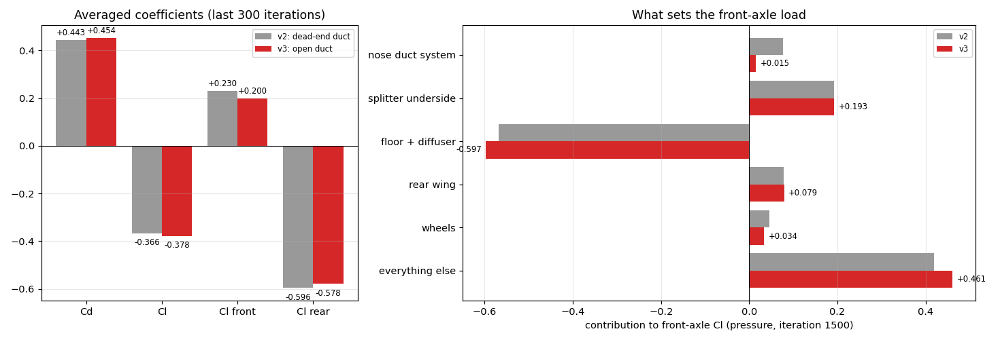
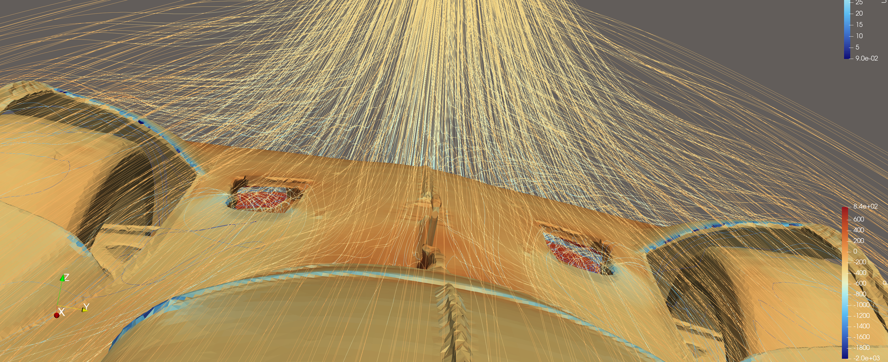
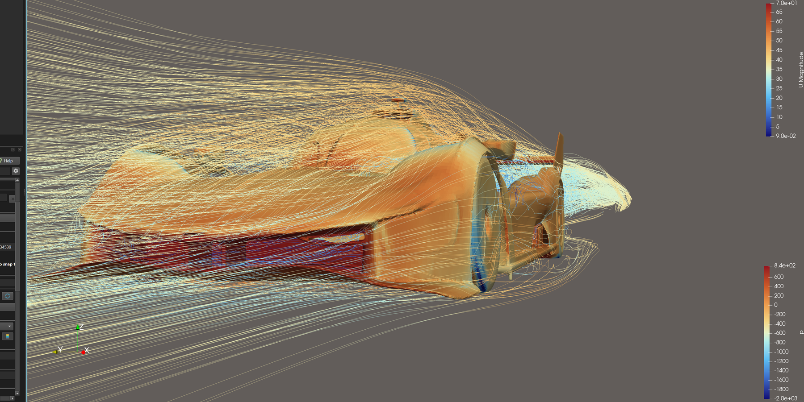
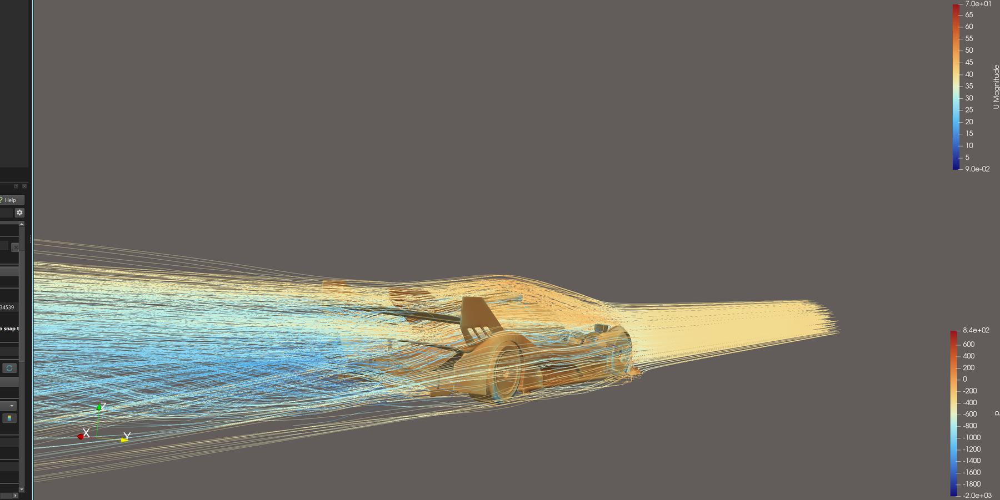
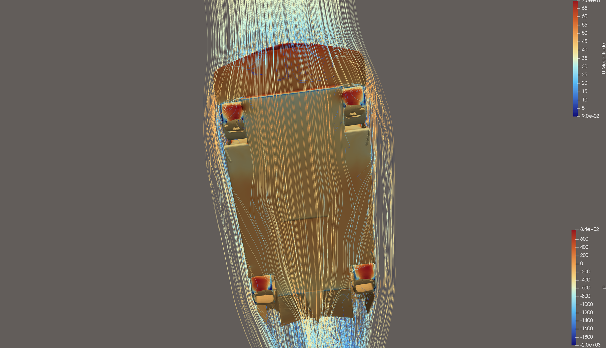
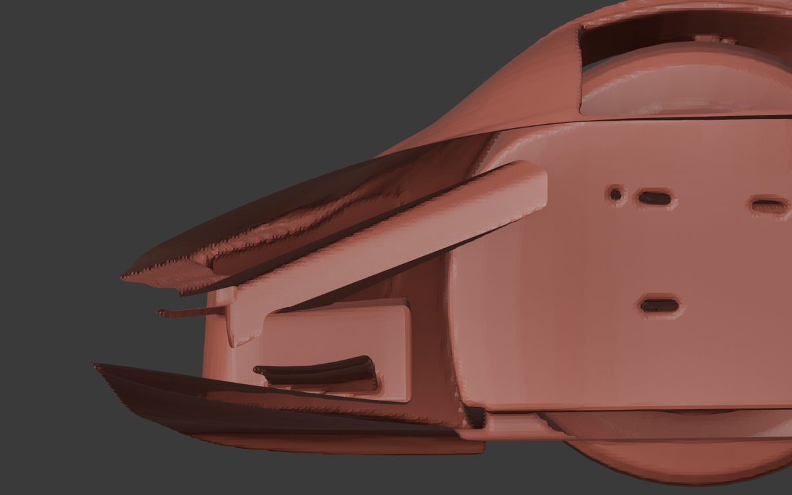
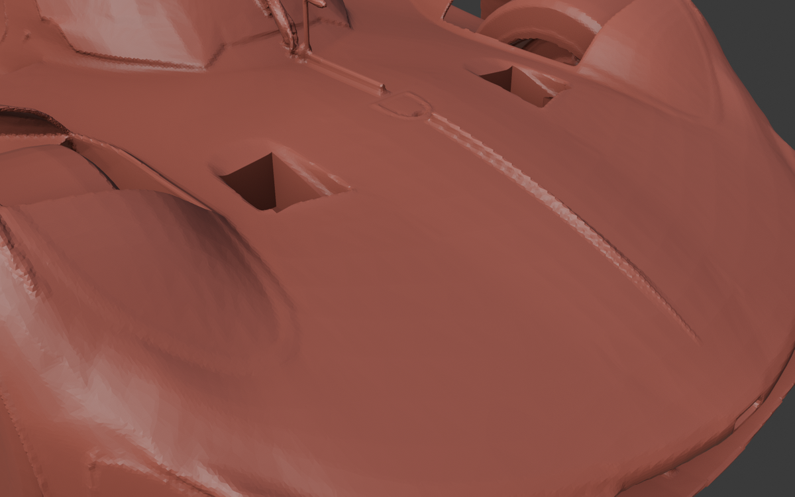

# Ferrari 499P, v3: Opening the Nose Duct

[499P v2](../ferrari-499p-v2/) showed that the downloaded model's nose duct is a **dead end**: air enters under
the nose and stops against a solid wall. The duct filled with stagnant air, added drag, and couldn't produce the
front downforce it's there for. The front axle lifted.

v3 changes **only the duct**: a channel on each side runs from the back of the nose cavity, up through the
bodywork and out through the bonnet vents between the front wheels. Everything else is identical to v2: mesh
settings, domain, rotating wheels and reference values. So the difference between the two runs is the duct's effect.

| | Cells | Cd | Cl | Cl front | Cl rear |
|---|---:|---:|---:|---:|---:|
| v2 (dead-end duct) | 11.96 M | 0.443 ± 0.005 | −0.366 ± 0.028 | +0.230 | −0.596 |
| **v3 (open duct)** | **12.00 M** | **0.454 ± 0.004** | **−0.378 ± 0.021** | **+0.200** | −0.578 |
| Change | | +0.011 | −0.011 | **−0.030** | +0.018 |

Mean ± one standard deviation over the last 300 of 1500 iterations.

|  |
|:--:|
| The two bonnet vents, now open (red: positive pressure inside the channel, where air is pushed through) |

|  |
|:--:|
| Three-quarter view |

|  |
|:--:|
| Side/rear view with the wake |

|  |
|:--:|
| Underside, viewed from below (flow runs top to bottom) |

*Body coloured by kinematic pressure p (m²/s², −2000 to +840); streamlines coloured by velocity magnitude (m/s).*

## Designing the duct

The duct was **modelled in Blender by me as a first Blender project**, then made mesh-ready:

| | |
|---|---|
| My design | A rounded tube from the front-outer corner of the nose cavity, tapering inboard as it climbs back to the bonnet vents (voxel-remeshed for smooth walls) |
| Problems in my first attempts | The tube was too thin (~3.5 cm, only 2–4 mesh cells across); its ends *touched* the cavity ceiling and bonnet skin instead of passing through them, so the Boolean produced broken, overlapping faces; in one attempt the whole car was voxel-remeshed, which subtly reshaped every surface |
| Fixes (made with Claude, scripted in [`geometry/fix_jack3.py`](geometry/fix_jack3.py)) | Tube lowered 2 cm and thickened to ~8 cm (stacked copies merged with a voxel remesh of the **cutter only**); a vertical riser added inside each vent recess so the exit breaks cleanly through; a single Exact Boolean into an untouched v2 car |
| Check | Closed, manifold surface (0 non-manifold edges; OpenFOAM `surfaceCheck` passes); only the nose changed (0 vertices moved beyond x = 1 m); wheels identical to v2 |

|  |  |
|:--:|:--:|
| Section at y = 0.45 m: the channel from the cavity up to the vent | The two vent exits |

**Lessons:** a Boolean cutter must pass all the way through a surface and end in open air, never lie on it.
Remesh or smooth the *cutter*, not the car. And always check for 0 non-manifold edges before exporting.

The real car's internal duct shape isn't public, so this is a **plausible design**, not Ferrari's. The question it
answers is how much the front balance changes once air can flow through the nose.

## What the open duct did

**1. Air now flows through it.** Sampling the flow on planes through the channels:

| | v2 | v3 |
|---|---:|---:|
| Flow through the two channels (x = 0.50 m) | stagnant | **0.90 m³/s** at ~20 m/s |
| Pressure in the channel | Cp +0.45 to +0.51 | Cp +0.18 |
| Share of the air entering the nose inlet | 0 | ~22 % |

**2. It works as a front downforce device.** The duct system's contribution to front-axle lift fell from
**+0.076 to +0.015**, and the front axle lost 0.030 of lift overall.

**3. It did not reduce drag** (Cd +0.011). The inlet face still stagnates, and air leaving the vents upward into
the flow over the bonnet costs some drag. A real vent exit is shaped to send the air rearward along the bodywork.

**4. The front axle still lifts (+0.20).** The biggest remaining contributor is the **splitter's underside**, unchanged
at Cp +0.32 and responsible for +0.19 of front-axle lift on its own. It sits below the splitter plate, so the duct
can't influence it. On a real Le Mans prototype that surface runs in suction. That's the natural target for a v4.

Full breakdown: [`results/duct_analysis.txt`](results/duct_analysis.txt).

## Setup and checks

- **Mesh:** 12.0 M cells, 3 prism layers with 90.0 % coverage, 8 highly skewed faces (v2: 7).
- **y+:** mean 80 on the body, 72–77 on the wheels.
- **Convergence:** Cd changed by 0.1 % between iterations 900–1200 and 1200–1500.
- **Run:** 4.0 h on 8 cores. The solver used 21–22.5 GB of the 25 GB available, and swap was never used. `controlDict` kept only
  the last 2 saved iterations and wrote no EnSight output, so the case used 10 GB of disk instead of about 28 GB.

## Files

- [`case/`](case/): the complete case, run with `./Allrun`. The geometry is `constant/triSurface/f499p.stl.gz`, already
  split into body + 4 wheels.
- [`geometry/`](geometry/): the Blender script that thickened the duct and made the cut, plus renders of the result.
- [`results/`](results/): force histories (whole car and wheels only), residuals, y+, logs, and the duct analysis.
