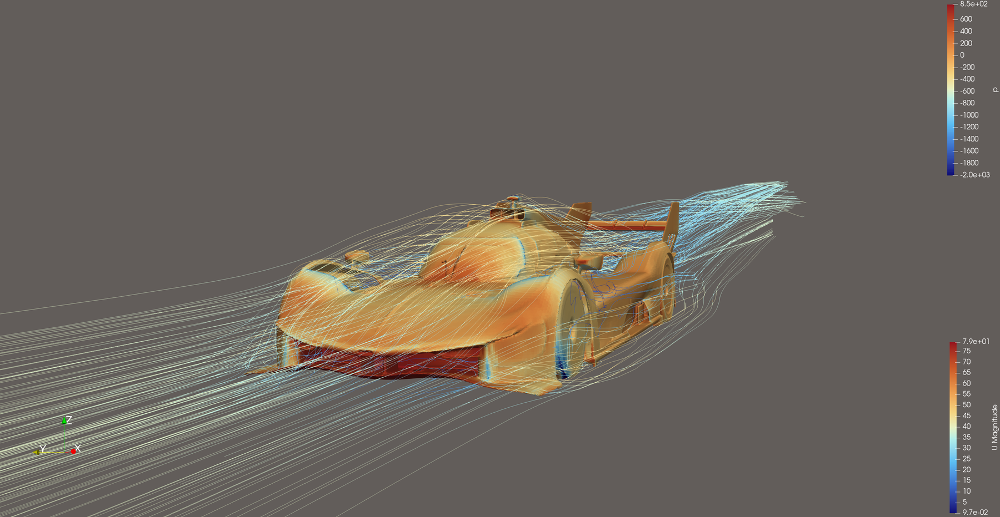
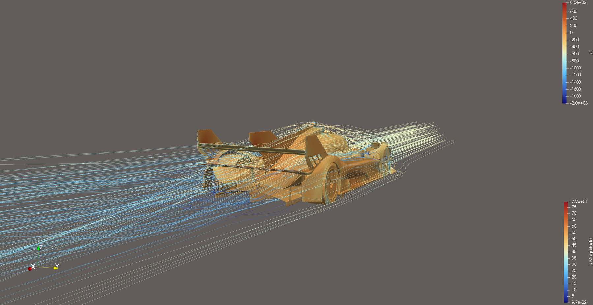
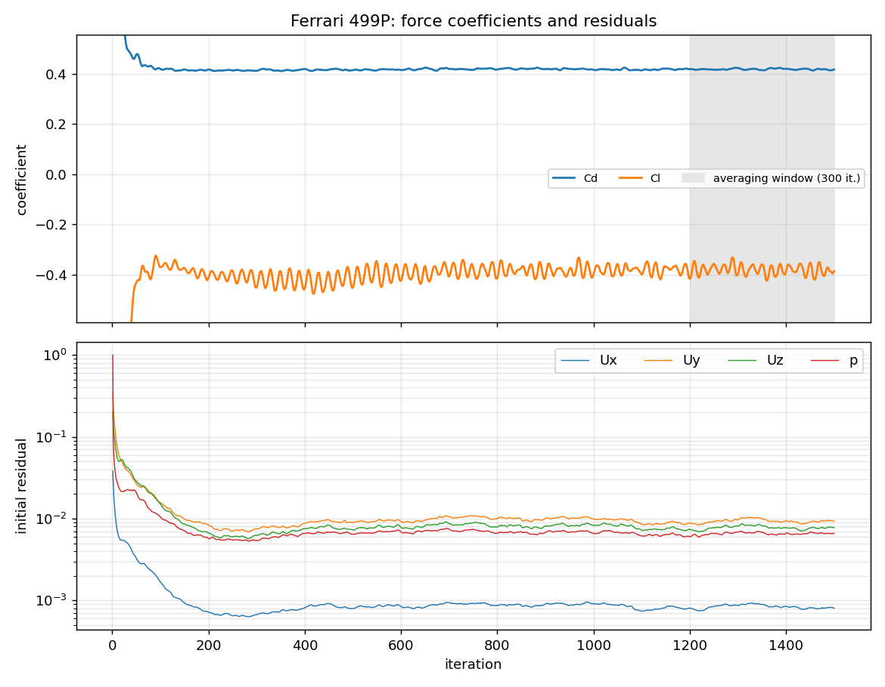

# Ferrari 499P (Le Mans Hypercar)

External aerodynamics of the Ferrari 499P, a Le Mans Hypercar. It's the only car in
this set designed to produce downforce, so this case looks at how that downforce
is split between the front and rear.

|  |
|:--:|
| Front three-quarter view |

|  |
|:--:|
| Rear three-quarter view |

*Body surface coloured by kinematic pressure p (m²/s², fixed range −2000 to +840; +800 is the stagnation value ½U² at 40 m/s). Streamlines coloured by velocity magnitude (m/s).*

## Setup

| | |
|---|---|
| Geometry | ["2024 Ferrari 499P"](https://sketchfab.com/3d-models/2024-ferrari-499p-bed18b70ae904a3792a316d9327d5942) by Dave Love SketchFab (CC BY 4.0), repaired and made watertight |
| Reference values | Frontal area 1.6437 m² (measured, see [`frontal_area.png`](results/frontal_area.png)), wheelbase 3.15 m |
| Freestream | 40 m/s |
| Turbulence | k-ω SST with wall functions |
| Mesh | 4.72 M cells (90 % hexahedra), 1 prism layer |
| Mesh quality | 14 faces above the skewness limit (max 6.6); all other checks passed |
| y+ on body | mean 87 |
| Run time | 1500 iterations, 1.4 h on 6 cores |

## Results

| | Value |
|---|---:|
| Cd | 0.419 ± 0.002 |
| Cl | −0.381 ± 0.019 |
| Cl front / rear | −0.056 / −0.325 |
| −Cl/Cd (lift-to-drag ratio) | 0.91 |

## Correction applied to the results

The solver ran with the Mustang's
reference area (2.2695 m²) and length, carried over from the Mustang case. The raw `coefficient.dat` is kept exactly as the
solver wrote it, and its header shows the values that were used. Force coefficients
scale with 1/Aref, so the Cd and Cl above are the raw values multiplied by
2.2695 / 1.6437 = 1.381. The moment coefficients also depend on the reference length and
moment reference point, so they aren't corrected and shouldn't be used. `system/forceCoeffs`
in this repo contains the correct values.

## Nonphysical pressure in a few cells

OpenFOAM's `p` is kinematic (pressure divided by density, in m²/s²). At 40 m/s it should range from about +800 at the
stagnation point down to a few thousand negative. In the final solution, 150 cells fall below −3,000 and the
minimum is −45,856, while 99.99 % of cells lie between −2,050 and +800. These cells sit next to the highly skewed
faces reported by `checkMesh`. They're too few to affect the integrated forces, but they stretch the automatic colour
range in ParaView, which is why the images above use a fixed range of −2000 to +840.
The fix is to improve the local mesh quality there (surface repair, snapping controls or mesh-quality settings in
`snappyHexMeshDict`).

## Discussion

- **The downforce sits mostly at the rear** (85 % of the total). A real LMH car is set
  up closer to the centre of gravity for balanced handling, so this shows the limits
  of the model more than the real car's setup.
- **The downforce is probably too low for a Le Mans prototype.** Likely reasons are that the
  visual model lacks real underfloor and diffuser detail, the ride height and rake are
  uncertain, the wheels don't rotate, and a single prism layer is used. The underfloor
  generates much of a prototype's downforce, and it's the part of the geometry that's
  least accurate here.
- **Next steps:** check the ride height and rake, add rotating-wheel boundary conditions
  (or an MRF zone), add more prism layers under the floor, and compare the
  surface-pressure distributions on the floor and rear wing.

## Files

- [`case/`](case/): the complete OpenFOAM case (geometry in `constant/triSurface/f499p.stl.gz`)
- [`results/`](results/): coefficient and residual histories, y+, logs
