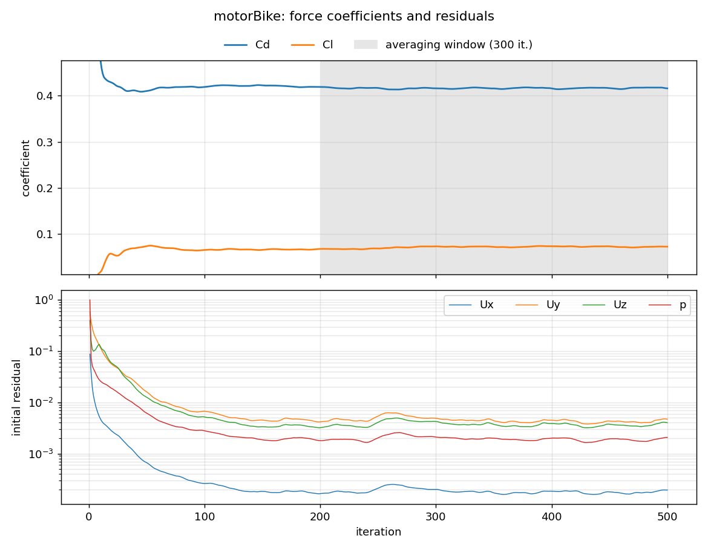

# motorBike (OpenFOAM tutorial)

The standard `incompressible/simpleFoam/motorBike` tutorial: a motorcycle and rider at
20 m/s. I ran it first to learn the workflow (blockMesh, snappyHexMesh, parallel
simpleFoam, post-processing) before building the car cases on the same template.

## Setup

| | |
|---|---|
| Geometry | `motorBike.obj.gz` from the OpenFOAM tutorials (copied in by `Allrun`) |
| Reference values | Frontal area 0.75 m², length 1.42 m |
| Freestream | 20 m/s |
| Turbulence | k-ω SST with wall functions |
| Mesh | 0.35 M cells, 1 prism layer |
| Run time | 500 iterations, 96 s on 6 cores |

## Results

| | Value |
|---|---:|
| Cd | 0.416 ± 0.001 |
| Cl | +0.071 ± 0.002 |

## Files

- [`case/`](case/): the tutorial case as run
- [`results/`](results/): coefficient and residual histories, logs
