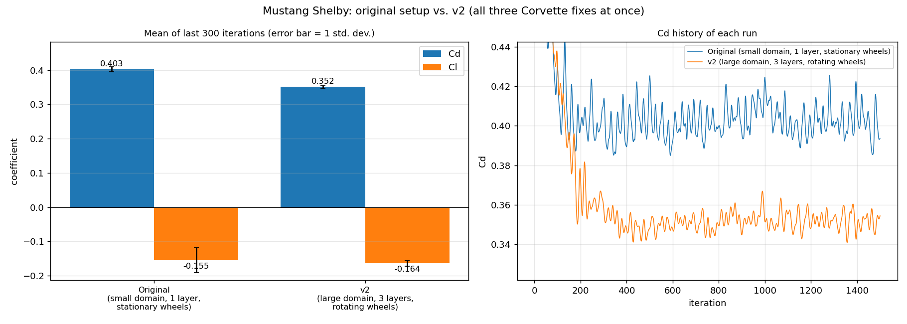
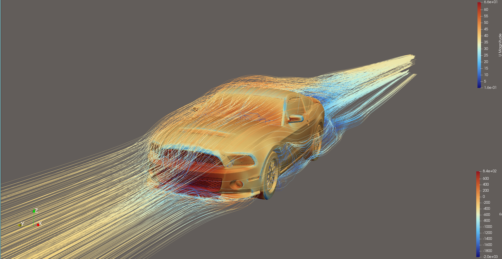
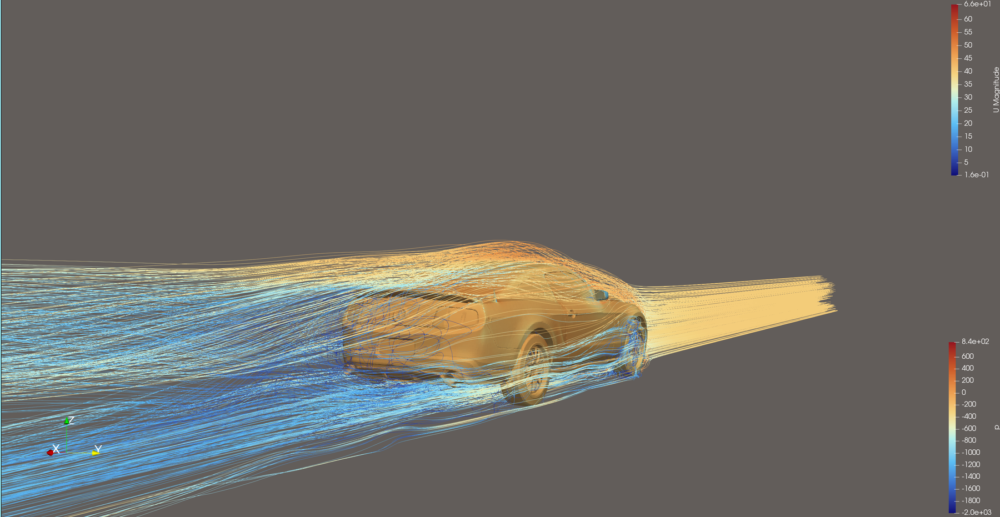
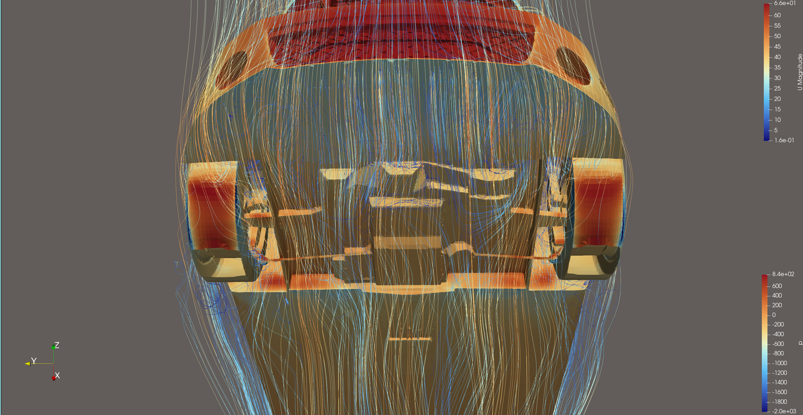
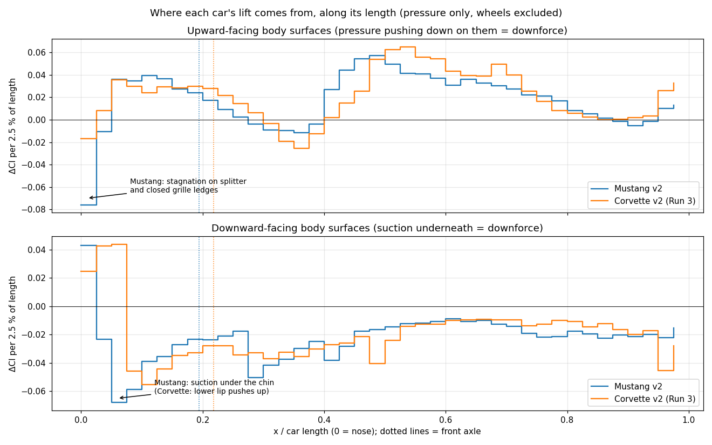
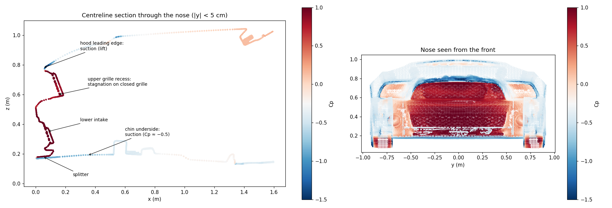
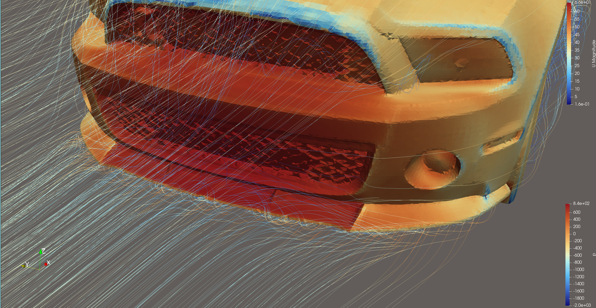

# Ford Mustang Shelby (2012), v2: Where Does the Front Downforce Come From?

The [original Mustang run](../mustang/) predicted **front downforce**, which is unusual for a
production car. Most road cars have some front lift. This case re-runs the Mustang with the setup
validated on the [Corvette v2](../corvette-v2/) study, then uses the surface pressure to trace
where that downforce comes from.

| | Cells | Cd | Cl | Cl front / rear |
|---|---:|---:|---:|---:|
| [Original](../mustang/) | 3.9 M | 0.403 ± 0.008 | −0.155 ± 0.036 | −0.135 / −0.020 |
| **v2** | **10.3 M** | **0.352 ± 0.004** | **−0.164 ± 0.008** | **−0.134 / −0.030** |
| v2, wheels only | | 0.056 | +0.038 | +0.037 / +0.001 |

Mean ± one standard deviation over the last 300 of 1500 iterations; frontal area 2.2695 m².

- **Drag dropped 51 counts (−13 %).** That's more than the Corvette's 29, which fits the Mustang's higher original
  blockage (3.8 % vs. 3.3 %) and its larger, more exposed wheels.
- **The solution is much steadier.** Lift fluctuation fell from ±0.036 to ±0.008, so the original run's large
  oscillations came partly from the setup.
- **The front downforce didn't change** (−0.135 → −0.134). New domain, mesh and wheels left it
  untouched, so it comes from the geometry, not the setup.

|  |
|:--:|
| Front three-quarter view |

|  |
|:--:|
| Rear three-quarter view |

|  |
|:--:|
| Underside, viewed from below (flow runs top to bottom) |

*Body coloured by kinematic pressure p (m²/s², fixed range −2000 to +840; +800 is the stagnation value ½U² at 40 m/s).
Streamlines coloured by velocity magnitude (m/s).*

## What changed from the original

This run applies all three fixes measured one at a time in the [Corvette v2 study](../corvette-v2/) together,
so it doesn't separate their individual effects for the Mustang. The Corvette study already did that.

| | Original | v2 |
|---|---|---|
| Domain | 35 × 10 × 6 m, blockage 3.8 % | 60 × 20 × 10 m, blockage 1.1 % |
| Prism layers | 1 | 3 (expansion 1.2); 2.1 achieved on average, 87.7 % coverage |
| Near-car refinement | 31 mm box | + 16 mm box from 0.5 m ahead to 2.7 m behind the car |
| Wheels | stationary | rotating (`rotatingWallVelocity`), ω = −U / r |
| Moment reference point / length | x = 2.4 m / 2.72 m | x = 2.294 m / 2.736 m (true wheelbase midpoint and length, so the front/rear lift split is correct) |
| `controlDict` | pasted-in copy of the force settings | `#include "forceCoeffs"` |
| Cores | 6 | 8 |

**Wheel splitting was harder than on the Corvette.** This model includes coil-over springs and suspension arms,
and at the rear the spring coil passes through the tyre's inner sidewall. A plain "everything inside the wheel
cylinder" rule would have rotated the springs. [`tools/split_wheels.py`](../tools/split_wheels.py) now accepts
exclusion boxes; see [`wheels.json`](case/constant/triSurface/wheels.json). Tyres, rims and hubs rotate, while
springs, arms, arches and liners stay stationary. The bottom of each front strut, hidden inside the rim barrel,
is labelled as wheel, which is a negligible compromise.

| Axle | Centre x | Rolling radius | ω (rad/s) | Published tyre radius |
|---|---|---|---|---|
| Front (255/40R19) | 0.926 m | 0.3425 m | −116.8 | 0.343 m |
| Rear (285/35R19) | 3.662 m | 0.3494 m | −114.5 | 0.341 m |

## Where the front downforce comes from

Comparing the surface-pressure lift along both cars, they look alike from the front axle backwards.
**The whole difference is ahead of the front axle:**

| Ahead of the front axle | Upper surfaces | Lower surfaces | Net |
|---|---:|---:|---:|
| Corvette | +0.190 | −0.123 | **+0.068 (lift)** |
| Mustang | +0.105 | −0.227 | **−0.122 (downforce)** |

The Corvette's nose is low and pointed, only 9 cm off the ground, and its stagnation zone sits on a
downward-facing lower lip that pushes the nose *up*. The Mustang's nose is a tall, blunt wall from
17 cm to 78 cm above the ground, with a large grille, lower intake, air dam and splitter:

|  |
|:--:|
| Close-up of the grille, lower intake and splitter. Dark red is stagnation (Cp ≈ 1) on the closed grille mesh and on top of the splitter. |

| Nose surface | Mean Cp | Cl | Real or model artifact? |
|---|---:|---:|---|
| Chin underside behind the air dam (0.75 m²) | −0.46 | **−0.162** | **Real design effect:** air speeds up under the air dam's sharp lower edge |
| Splitter top (0.19 m²) | +0.65 | **−0.045** | **Real:** stagnation on the splitter pushes the nose down, which is what a splitter is for |
| Upper grille ledges (0.32 m²) | +0.48 | −0.058 | **Artifact:** the grille is a closed surface |
| Lower intake ledges (0.12 m²) | +0.76 | −0.027 | **Artifact:** the intake is a closed surface |
| Bumper and hood leading edge (0.32 m²) | −0.56 | +0.061 | Real: suction as the flow turns over the nose |

**Conclusion:** the Mustang's air dam, chin and splitter are designed to reduce front lift, and the CFD shows
that working. But the downloaded model has **no radiator, no engine bay and no cooling flow**. Its grille and
intake are solid surfaces, so the air stagnates against them, adding about −0.085 of nose downforce that
wouldn't exist on the real car. Cooling air passing through the real car would also raise the pressure under the
hood and front underbody, adding front lift. **This model overpredicts front downforce; the real car most likely
has small front lift or close to zero.**

The same limitation applies to every car in this repo. It matters most for the Mustang, whose grille is large and
upright; the Corvette's is small and low.

**Next step for this question:** open the grille and intake, and model the radiator as a porous region with
a realistic pressure loss, so cooling air flows through the front of the car and out through the engine bay.

## Other checks

- **Mesh quality:** 12 highly skewed faces (max skewness 5.3), against 11 in the original.
- **y+:** mean 84 on the body and 100–114 on the wheels, within the wall-function range.
- **Convergence:** Cd changed by 0.2 % between iterations 900–1200 and 1200–1500.
- **Run time:** 3.2 h on 8 cores.

## Files

- [`case/`](case/): the complete case. Run it with `./Allrun` (8 cores). The geometry is
  `constant/triSurface/mustang.stl.gz`, already split into body + 4 wheels.
- [`results/`](results/): force histories for the whole car (`forceCoeffs1/`) and the wheels only
  (`wheelCoeffs/`), residuals, y+, logs.
- [`results/front_downforce_analysis.txt`](results/front_downforce_analysis.txt): the full lift breakdown.
- [`results/analysis/`](results/analysis/): lift distribution and nose pressure plots.
