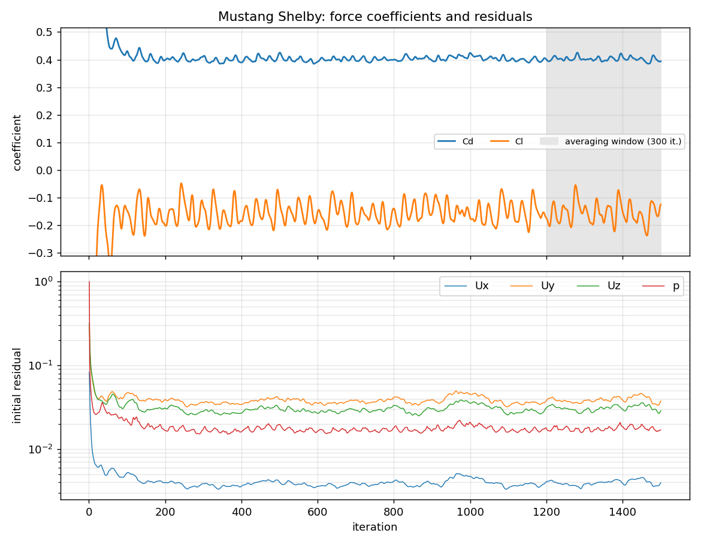

# Ford Mustang

External aerodynamics of a production muscle car.

## Setup

| | |
|---|---|
| Geometry | Sketchfab model (CC BY 4.0), cleaned and made watertight |
| Reference values | Frontal area 2.2695 m² (measured, see [`frontal_area.png`](results/frontal_area.png)), wheelbase 2.72 m |
| Freestream | 40 m/s |
| Turbulence | k-ω SST with wall functions |
| Mesh | 3.89 M cells (90 % hexahedra), 1 prism layer |
| Mesh quality | 11 faces above the skewness limit (max 5.1); all other checks passed |
| Run time | 1500 iterations (in two parts), 1.3 h on 6 cores |

## Results

| | Value |
|---|---:|
| Cd | 0.402 ± 0.008 |
| Cl | −0.158 ± 0.035 |
| Cl front / rear | −0.135 / −0.023 |

## Run history

The first run was interrupted while it was writing the results for iteration 1400,
so those files were incomplete. A restart from 1400 failed straight away when it tried
to read the incomplete `omega` file
([`log.simpleFoam2`](results/logs/log.simpleFoam2.gz)). The case was then restarted
from iteration 1300 and ran to 1500 ([`log.simpleFoam3`](results/logs/log.simpleFoam3.gz)).
`forceCoeffs1/0` and `forceCoeffs1/1300` are the two segments, and
`tools/plot_results.py` joins them.

## Discussion

- **This case has the largest oscillations in the set** (Cd ±2 %, Cl ±22 %). The flow
  behind the fastback rear doesn't settle into a steady state, and 200 iterations after
  the restart is a short averaging window. Running longer, or a time-accurate simulation
  (URANS), would give a more reliable mean.
- **Lesson learned:** save results often enough that an interrupted run can restart from
  a recent point, and check that the last saved iteration is complete before restarting.

## Files

- [`case/`](case/): the complete OpenFOAM case (geometry in `constant/triSurface/mustang.stl.gz`)
- [`results/`](results/): coefficient and residual histories (both segments), logs
